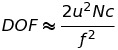

============================
Digital Image Focus Stacking
============================

Wiki: A digital image processing technique which combines multiple images taken
at different focus distances to give a resulting image with a greater depth of
field (DOF) than any of the individual source images.

Basic Information
=================

Git hub repository:
https://github.com/TommyLin/focus-stacking

Problem To Solve
================

When macro photography, the short depth of field (DOF) makes clear image only
in a small area because of very short distance to subject. **To get a clear
(focused) image in a wide range**, the photographer can shrink and use small
aperture size. But shrinking aperture size has two side effects as follow:

1. Increase diffraction effect that causes image blurry
2. Decrease exposure energy that makes noise relatively increase

So there are limits to get a clear photo by just shrinking aperture with one
shot. Here are three photos to show the effect of aperture size.

+-------------------------------------+-------------------------------------+------------------------------------+
| .. image:: wiki/Dof_blocks_f1_4.jpg | .. image:: wiki/Dof_blocks_f4_0.jpg | .. image:: wiki/Dof_blocks_f22.jpg |
| Aperture=/1.4, DOF=0.8cm            | Aperture=f/4.0, DOF=2.2cm           | Aperture=f/22, DOF=12.4cm          |
+-------------------------------------+-------------------------------------+------------------------------------+
*. Source: https://en.wikipedia.org/wiki/Depth_of_field

Definition of depth of field (DOF)
__________________________________

+--------+----------------------+--------------------------------+
| Symbol | Definition           | Example                        |
+========+======================+================================+
| c      | circle of confusion  | Canon APS-C camera CoC=0.018mm |
+--------+----------------------+--------------------------------+
| f      |  focal length        | EF100mm f/2.8L MACRO IS USM    |
+--------+----------------------+--------------------------------+
| N      |  f-number            | f/2.8, f/4, f/10, f/16         |
+--------+----------------------+--------------------------------+
| u      |  distance to subject | 5cm ~ 20cm for Camera          |
+--------+----------------------+--------------------------------+
For example: A Canon APS-C camera with conditions in previous table and assume 
N=10, u=10cm=100mm, this will result:

**DOF = 0.36mm**

The value of DOF=0.36mm is too small to get a clear image for object.
Fortunately, photographer can take multiple **"digital"** photos and stack these
photos together to make a focused photo in large area.

+-------------------------------------------------------+
| .. image:: wiki/750px-Focus_stacking_Tachinid_fly.jpg |
+-------------------------------------------------------+
*. Source: https://en.wikipedia.org/wiki/Focus_stacking

Algorithm
=========

Edge detection
______________

Pixel values change fast (sharp) in the focused area. Pixel values chage gentlely
(soft) in the defocused aread. The sharp aread consider as edge that pixel value
varies fast. Follow steps aim to find the edges in a photo.

1. Perform a **Gaussian blur** on image with following kernel:

::

   1  2  1
   2  4  2
   1  2  1

2. Perform a **Laplacian Edge Detection kernel** on Gaussian Blurred image:

::

   -1 -1 -1
   -1  8 -1
   -1 -1 -1

3. Take absolute value of Laplacian of Gaussian (LoG) result. This will quantify
   the strength of edges with respect to the size and strength of kernel.
4. Create a blank image, loop through each pixel and find the strongest edge in
   the LoG(i.e. the highest value in the image stack) and take the RGB value for
   that pixel from the corresponding image.

Structural Similarity Index Measure (SSIM)
__________________________________________
The structural similarity index measure (SSIM) is a method for predicting the
perceived quality of digital television and cinematic pictures, as well as other
kinds of digital images and videos. SSIM is used for measuring the similarity
between two images.

.. image:: https://wikimedia.org/api/rest_v1/media/math/render/svg/1783c17346b8f4c822ed206798bb6769a845c417

The resultant SSIM index is a decimal value between -1 and 1, and value 1 is
only reachable in the case of two identical sets of data and therefore indicates
perfect structural similarity. A value of 0 indicates no structural similarity.

Prospective Users
=================

Macro photography or optical microscopy users who wants to take a clear image.
They must have equipment to take multiple digital photos. This project could
help to stack photos took with stepped focus distances.

System Architecture
===================

**Image capture** (hardware)
____________________________

[Camera] --- PTP ---- [Control [#]_]

"**Control**" Command [#]_ camera to shoot photos with stepped focus distances,
but the hardware part is not included in this project.

.. [#] Control could be PC or embedded system such as Raspberry PI.
.. [#] This can be achived by using `Canon Digital Camera Software Development Kit (CD-SDK) <https://asia.canon/en/campaign/developerresources>`_.

**Focus stacking** (software)
_____________________________

[**Scan for images**] ==> [**Grouping**] ==> [**Edge detect**] ==> [*Alignment* [#]_] ==> [*White Balance*] ==> [**Focus stacking**]

.. [#] Alignment and white balance are not included in this project. Tested images are created and always aligned and white balanced.

API Description
===============

User APIs: (Open to users)
__________________________

.. [focus_stacking] Auto scan mode: Users select specific directory that contain photos. This API
  will scan directory and determinate the groups of photos depend on SSIM value. Then stack these
  images together within one group.

``int focus_stacking(path target_path, fd* image_fd)``
    Do focus stacking in specified folder

Return value:
  0: Success

  Others: Fail

target_path:
  Folder to store photos

image_fd:
  Photo file descriptors

Private APIs (Internal used only)
________________________________________

``image gaussian_blur(image input, kernel gaussian)``
  Blur image with gaussian filter

``image edge_detect(image input, kernel laplacian)``
  Detect edge with lapacian filter

``image stacking(image source[], image log_mask)``
  Stcking multiple images with correponding "Laplacian on Gaussian" mask

``int ssim(image image1, image image2)``
  Calculate SSIM of two input images

Types and Strcutures
====================

C style

::

  struct image_t {
      int   hight;
      int   width;
      char** raw_data;
  }

::

  struct kernel_t {
      int   rank;
      char* kernel;
  }

C++ style (prefer this style to use modern C++ technology)

::

  class image {
     int hight;
     int width;
     <array> raw_data
  }

::

  class kernel {
     int rank;
     vector<vector<int> > matrix(3);
  }

Engineering Infrastructure
==========================

Algorism Performance Evaluation
_______________________________

To evaluate the algorism performance in this project, testing images are created 
from a source image(focused). This also prevent alignment procedure to do focus
stacking. Here is the steps to evaluate algorism performance.

1. Get a clear and focused source image (image1)
2. Smooth souce image with a set of mask by Gaussian blur kernel
3. Through the focus stacking API [focus_stacking]_ to combine these blurred images into image2
4. Calculate SSIM of image1 and image2 to tell the performance of focus stacking algorism.

Coding Style Check
__________________

checkpatch.pl

::

    $ $(kernel)/scripts/checkpatch.pl -f source.cpp

Static Analysis Tool
____________________

`cppcheck -- A static analysis tool for C/C++ code <http://cppcheck.sourceforge.net/>`_

::

    $ cppcheck .

Source Code Coverage Analysis
_____________________________

Source code coverage analysis here is used to check unit test coverage of whole source code. There are two cases concerned as follow:

* Improve testing procedure coverage, if there was source code not covered by testing.
* Remove redundant code, if there was no condition could cover or test it.

`gcov -- a Test Coverage Program <https://gcc.gnu.org/onlinedocs/gcc/Gcov.html>`_

`LCOV - the LTP GCOV extension <http://ltp.sourceforge.net/coverage/lcov.php>`_

Steps to create code coverage information:

1. Enable coverage testing the program and compiled with the following options:

   ``$ gcc -Wall -fprofile-arcs -ftest-coverage cov.c``

2. Running test

   ``$ python3 -m pytest -v``
   (This will create *.gcov)

3. Generate html formate report from *.gcov

   ``$ make lcov``
   
   Makefile
::

   TARGET = _vector
   lcov:
           lcov --capture --directory . --output-file $(TARGET).info --test-name $(TARGET)
           genhtml $(TARGET).info --output-directory output --title "$(TARGET)" --show-details --legend

4. Browse result at ``./output/index.html`` with browser.

Estimated Computations
======================

Conditions:

* Image size: 5184x3456 (RGB)
* Kernel size: 3x3
* Gaussian / Laplacian filtering => x2

For the focus stacking part:

5184 x 3456 x 3 x (3 x 3) x 2 multiplications and additions per image

Then multiply with how many photos in the directory to stack.

For the SSIM part:

5184 x 3456 x 3 x (9 multiplication , 1 division, 6 addition)

Assume there are 4 photos in directory. To determinate the relationship of each other, above SSIM calculation needs to multiply with (4 x 3 / 2) = 6.

Schedule
========

* Week 1: [Python] Generate defocused photos (Gaussian blur)
* Week 2: [C++] Evaluate SSIM of two photos
* Week 3: Github CI
* Week 4: [Python] Setup testing environment
* Week 5: [Python] Browse directory and read image
* Week 6: [C++] Gaussian blur & Laplacian edge detection
* Week 7: [C++] Image stacking
* Week 8: [Python/C++] Debug and optimization

References
==========

1. https://en.wikipedia.org/wiki/Focus_stacking
2. https://en.wikipedia.org/wiki/Depth_of_field
3. https://en.wikipedia.org/wiki/Circle_of_confusion
4. https://en.wikipedia.org/wiki/Structural_similarity
